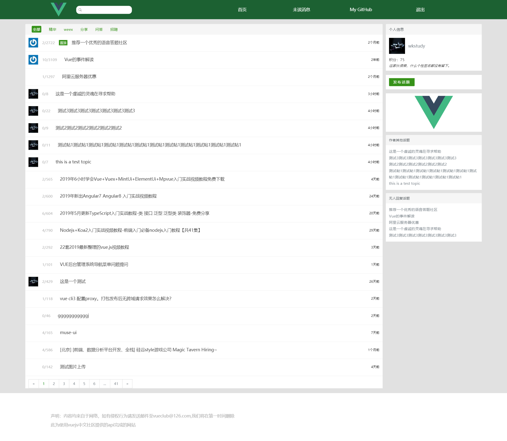
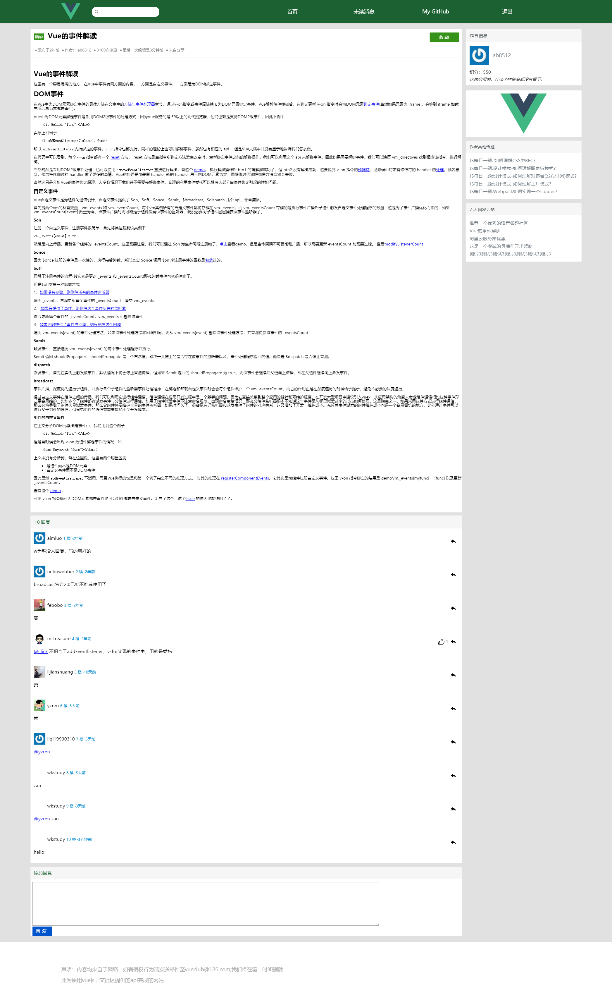
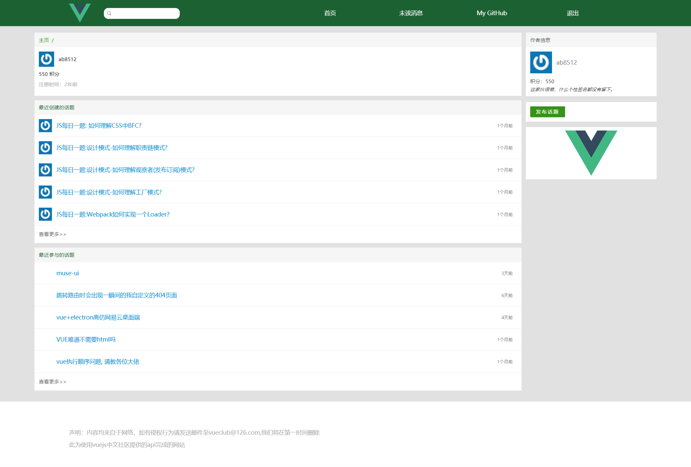
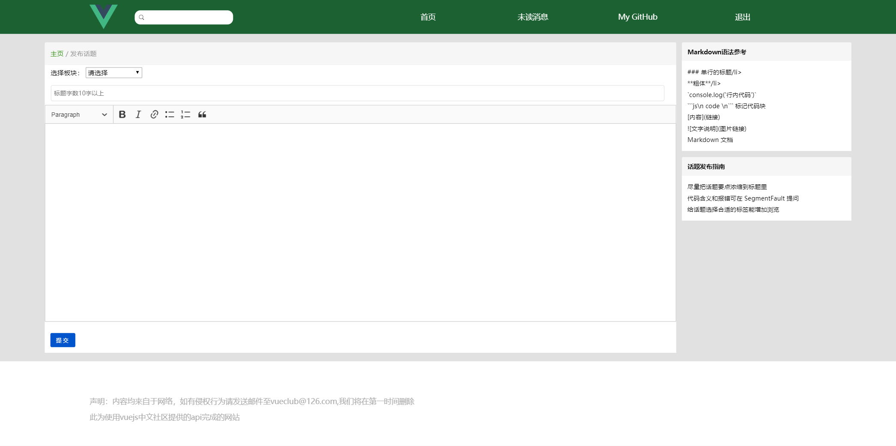

# vuecommunity

> \"vue中文社区的实现\"

## Build Setup

``` bash
# install dependencies
npm install

# serve with hot reload at localhost:8080
npm run dev

# build for production with minification
npm run build

```
## Description
* 使用了vue-router、vuex
* 使用了CKeditor富文本编辑器（有针对vue/react/angular开发的版本，简单易用）[ckeditor for vue](https://ckeditor.com/docs/ckeditor5/latest/builds/guides/integration/frameworks/vuejs.html)
* 使用了社区提供的几乎所有api
* 几乎和原社区完全相同
* 保留了编码过程中的主要分支
  * master 主分支
  * Common 公共组件
  * Home-list 首页
  * Home-page 分页组件（废弃）
  * Login  登录页
  * commonSideBar 侧边栏
  * message 未读消息页
  * pagination  分页组件
  * publishTopic 发布话题页
  * topics 话题页
  * user 用户页面
* 将分页组件单独发了一个npm包，有兴趣的同学可以看下[pagination component for vue](https://github.com/wkstudy/young-vue-components)

## Picture



